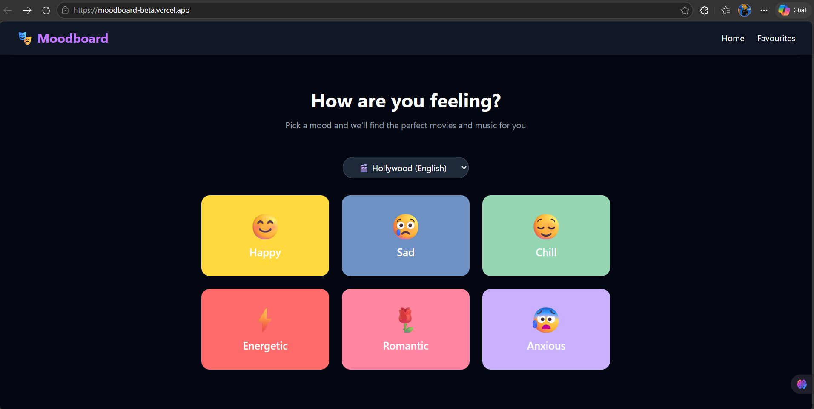
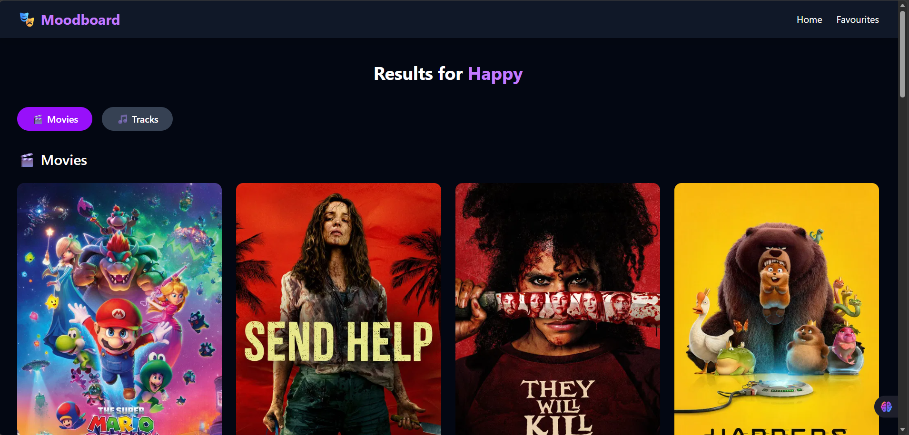
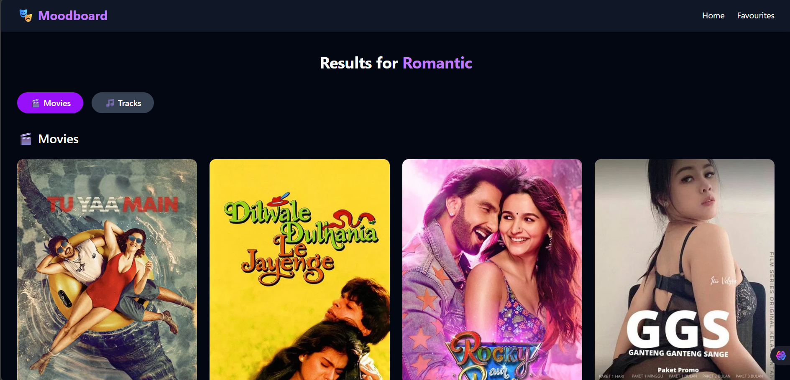
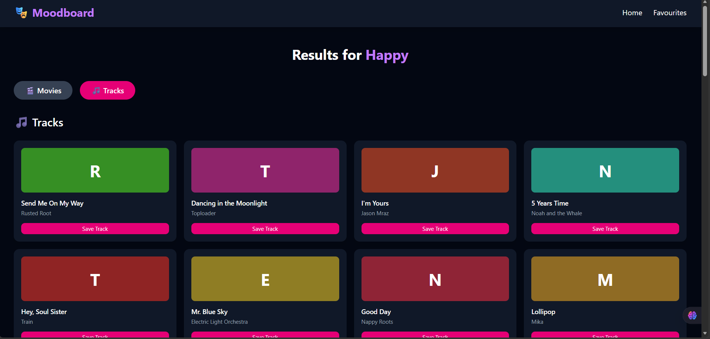
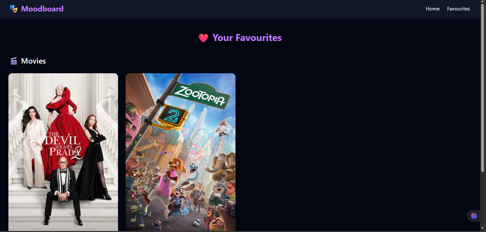

# 🎭 Moodboard

A mood-based movie and music discovery app. Tell us how you're feeling and we'll find the perfect movies and songs for you.

🔗 **Live Demo:** [moodboard-beta.vercel.app](https://moodboard-beta.vercel.app)

---

## ✨ Features

- **Mood Selector** — Choose from 6 moods: Happy, Sad, Chill, Energetic, Romantic, Anxious
- **Language Filter** — Browse movies and music from Hollywood, Bollywood, Korean, Spanish, French, and Japanese cinema
- **Movie Recommendations** — Fetches real movies from TMDB based on your mood and language
- **Music Recommendations** — Fetches real tracks from Last.fm based on your mood and region
- **Pagination** — Browse through all available movies page by page
- **Save to Favourites** — Save your favourite movies and tracks locally
- **Tabs** — Clean separation between Movies and Tracks on the results page
- **Responsive Design** — Works on mobile and desktop

---

## 🛠️ Tech Stack

| Technology | Usage |
|------------|-------|
| React | Frontend UI |
| React Router | Page navigation |
| Axios | API calls |
| Tailwind CSS | Styling |
| TMDB API | Movie data |
| Last.fm API | Music data |
| localStorage | Saving favourites |
| Vercel | Deployment |

---

## 📁 Project Structure

```
src/
├── components/
│   ├── MoodCard.jsx       # Individual mood card
│   └── Navbar.jsx         # Navigation bar
├── pages/
│   ├── Home.jsx           # Mood selector + language filter
│   ├── Results.jsx        # Movies + Tracks results
│   └── Favourites.jsx     # Saved movies and tracks
├── utils/
│   ├── moodData.js        # Mood names, emojis, colors
│   ├── moodMap.js         # Mood to TMDB genre ID mapping
│   ├── tmdbApi.js         # TMDB API calls
│   └── lastfmApi.js       # Last.fm API calls
├── App.jsx
└── main.jsx
```

---

## 🚀 Getting Started

### Prerequisites
- Node.js v18+
- TMDB API key — [themoviedb.org](https://www.themoviedb.org)
- Last.fm API key — [last.fm/api](https://www.last.fm/api)

### Installation

1. Clone the repository
```bash
git clone https://github.com/oorrvii/moodboard.git
cd moodboard
```

2. Install dependencies
```bash
npm install
```

3. Create a `.env` file in the root directory
```
VITE_TMDB_API_KEY=your_tmdb_api_key
VITE_LASTFM_API_KEY=your_lastfm_api_key
```

4. Start the development server
```bash
npm run dev
```

5. Open [http://localhost:5173](http://localhost:5173) in your browser

---

## 🎯 How It Works

```
User picks a mood + language
        ↓
App maps mood to TMDB genre ID
        ↓
Fetches movies from TMDB API
        ↓
Fetches tracks from Last.fm API
        ↓
Displays results in Movies / Tracks tabs
        ↓
User can save favourites to localStorage
```

---

### Home Page


### Results Page




### Favourites Page


---

## 🔮 Upcoming Features (v2)

- Movie detail page with overview, rating and where to watch
- Track detail page with artist info
- User accounts with cloud saved favourites
- Music pagination
- Trailer preview on movie cards

---

## 👨‍💻 Author

**Oorvi** — [github.com/oorrvii](https://github.com/oorrvii)

---

## 📄 License
This project is open source and available under the [MIT License](LICENSE).
